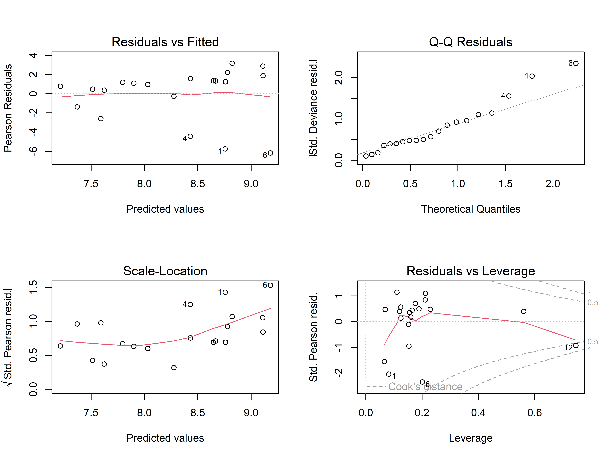
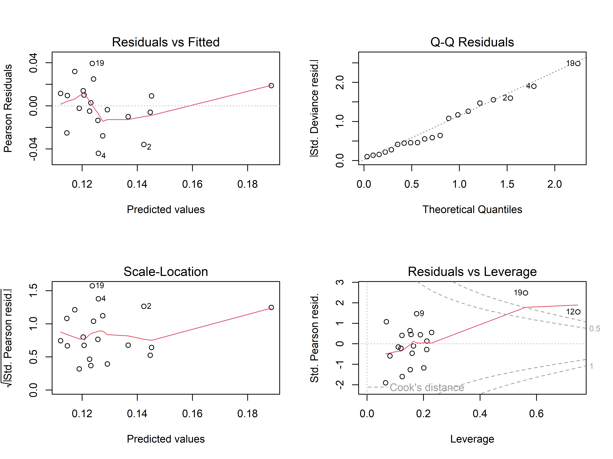
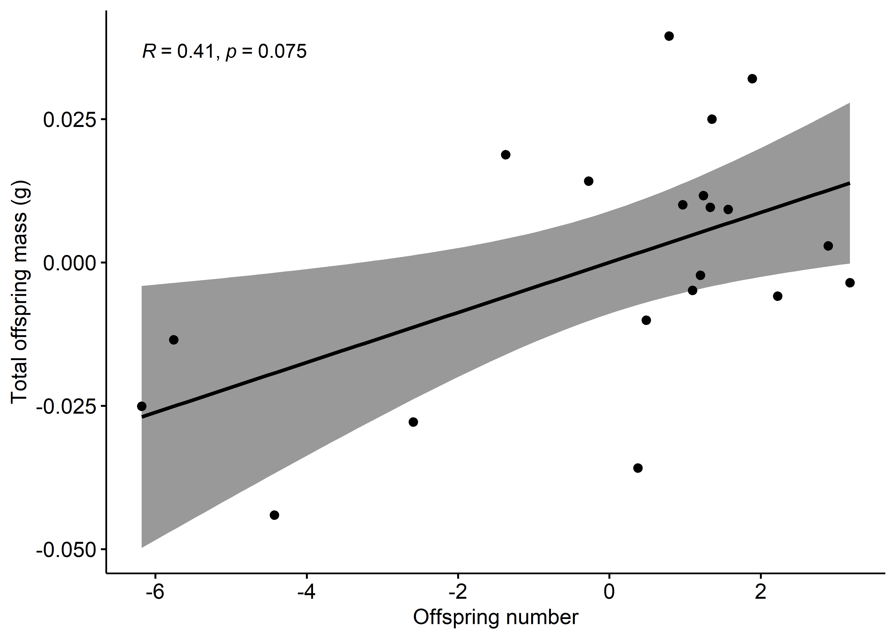

Análise de Performance de Desenvolvimento em Proles de Tityus pusillus
================
Welton Dionisio
2025-06-19

## Introdução

Fêmeas maiores geralmente são associadas a um maior investimento nos filhotes, mas como os recursos são limitados, muitas espécies precisam equilibrar entre ter mais filhotes ou filhotes maiores. Esse tipo de relação ainda é pouco estudada em espécies que produzem várias ninhadas ao longo da vida.

Neste estudo, analisamos como características maternas (tamanho e massa das fêmeas) se relacionam com características das proles (número e massa dos filhotes) no escorpião *Tityus pusillus*. Para isso, utilizamos uma amostra de 166 filhotes provenientes de 20 fêmeas coletadas na Mata Atlântica do Brasil.

Nossos resultados mostraram que o tamanho e a massa das mães não influenciaram o investimento nos filhotes, e não houve correlação estatística entre a massa total da ninhada e o tamanho dos filhotes. Assim como em espécies próximas, *T. pusillus* parece investir em ter mais filhotes, e não em filhotes mais pesados. Esse padrão reprodutivo pode contribuir para o sucesso reprodutivo e alta abundância populacional

## Métodos

### Carregamento e preparação dos dados

``` r
#install.packages("readxl") #instalando o pacote para leitura de planilhas do excel
library(readxl) #carregando o pacote no ambiente virtual
reprod3 <- read_excel("invest.reprod3.xlsx", sheet = 1, col_names = TRUE) #atribuindo os dados da planilha a uma variável
attach(reprod3) #possibilitando acessar as variáveis de dentro da planilha pelo seu nome nela
```

    ## The following objects are masked _by_ .GlobalEnv:
    ## 
    ##     FM, FS, TOM

    ## The following objects are masked from reprod3 (pos = 6):
    ## 
    ##     FM, FS, OS, TOM, TOM2

``` r
# Criando variáveis
TOM <- (reprod3$TOM2) #criando objeto/variável total offspring mass
ON <- (reprod3$OS) #criando objeto/variável offspring number
FS <- (reprod3$FS) #criando objeto/variável female size
FM <- (reprod3$FM) # criando objeto/variável female mass
```

### Testes de normalidade

``` r
# Testando a normalidade das variáveis
shapiro.test(TOM)
```

    ## 
    ##  Shapiro-Wilk normality test
    ## 
    ## data:  TOM
    ## W = 0.9401, p-value = 0.2409

``` r
shapiro.test(ON)
```

    ## 
    ##  Shapiro-Wilk normality test
    ## 
    ## data:  ON
    ## W = 0.90852, p-value = 0.05974

``` r
shapiro.test(FS)
```

    ## 
    ##  Shapiro-Wilk normality test
    ## 
    ## data:  FS
    ## W = 0.9146, p-value = 0.07803

``` r
shapiro.test(FM)
```

    ## 
    ##  Shapiro-Wilk normality test
    ## 
    ## data:  FM
    ## W = 0.91295, p-value = 0.07255

O resultado foi distribuição normal para todas as variáveis. Seguindo
para o modelo preditivo de quais variáveis/características da mãe
influenciam no fitness da prole.

## Análises

### Modelos Lineares Gerais

Para isso, foi utilizado um Modelo Linear Geral com critério de Akaike
(AIC). Assim foi testado qual o melhor modelo que representa a
influência da condição maternal sobre a ninhada.

``` r
# Modelo com número de filhotes na ninhada como variável dependente das condições maternais
glmON <- glm(ON ~ FS * FM, family = gaussian())
library(MASS) #carregando pacote
summary(glmON) #exibir sumário estatístico
```

    ## 
    ## Call:
    ## glm(formula = ON ~ FS * FM, family = gaussian())
    ## 
    ## Coefficients:
    ##             Estimate Std. Error t value Pr(>|t|)
    ## (Intercept)   9.4867    53.6145   0.177    0.862
    ## FS           -0.9927    13.8687  -0.072    0.944
    ## FM          -26.3148   299.3621  -0.088    0.931
    ## FS:FM        10.4369    76.7528   0.136    0.894
    ## 
    ## (Dispersion parameter for gaussian family taken to be 8.674545)
    ## 
    ##     Null deviance: 146.20  on 19  degrees of freedom
    ## Residual deviance: 138.79  on 16  degrees of freedom
    ## AIC: 105.5
    ## 
    ## Number of Fisher Scoring iterations: 2

``` r
anova(glmON) #realizar uma ANOVA a posteriori
```

    ## Analysis of Deviance Table
    ## 
    ## Model: gaussian, link: identity
    ## 
    ## Response: ON
    ## 
    ## Terms added sequentially (first to last)
    ## 
    ## 
    ##       Df Deviance Resid. Df Resid. Dev      F Pr(>F)
    ## NULL                     19     146.20              
    ## FS     1   3.3236        18     142.88 0.3831 0.5446
    ## FM     1   3.9232        17     138.95 0.4523 0.5109
    ## FS:FM  1   0.1604        16     138.79 0.0185 0.8935

``` r
# Modelo com massa total da ninhada como variável dependente das condições maternais
glmTOM <- glm(TOM ~ FS * FM, family = gaussian())
summary(glmON) #exibir sumário estatístico
```

    ## 
    ## Call:
    ## glm(formula = ON ~ FS * FM, family = gaussian())
    ## 
    ## Coefficients:
    ##             Estimate Std. Error t value Pr(>|t|)
    ## (Intercept)   9.4867    53.6145   0.177    0.862
    ## FS           -0.9927    13.8687  -0.072    0.944
    ## FM          -26.3148   299.3621  -0.088    0.931
    ## FS:FM        10.4369    76.7528   0.136    0.894
    ## 
    ## (Dispersion parameter for gaussian family taken to be 8.674545)
    ## 
    ##     Null deviance: 146.20  on 19  degrees of freedom
    ## Residual deviance: 138.79  on 16  degrees of freedom
    ## AIC: 105.5
    ## 
    ## Number of Fisher Scoring iterations: 2

``` r
anova(glmON) #realizar uma ANOVA a posteriori
```

    ## Analysis of Deviance Table
    ## 
    ## Model: gaussian, link: identity
    ## 
    ## Response: ON
    ## 
    ## Terms added sequentially (first to last)
    ## 
    ## 
    ##       Df Deviance Resid. Df Resid. Dev      F Pr(>F)
    ## NULL                     19     146.20              
    ## FS     1   3.3236        18     142.88 0.3831 0.5446
    ## FM     1   3.9232        17     138.95 0.4523 0.5109
    ## FS:FM  1   0.1604        16     138.79 0.0185 0.8935

### Visualização dos dados

``` r
library(ggplot2)

# Gráficos de diagnóstico dos modelos
par(mfrow = c(2, 2))
plot(glmON) #Gráficos do primeiro modelo
```

<!-- -->

``` r
plot(glmTOM) #Gráficos do segundo modelo
```

<!-- -->

### Modelos alternativos e seleção por AIC

``` r
# Modelo alternativo 1
model1 <- lm(ON ~ FS * FM * TOM)
summary(model1)
```

    ## 
    ## Call:
    ## lm(formula = ON ~ FS * FM * TOM)
    ## 
    ## Residuals:
    ##     Min      1Q  Median      3Q     Max 
    ## -4.3512 -1.1470  0.1418  0.9382  3.0983 
    ## 
    ## Coefficients:
    ##             Estimate Std. Error t value Pr(>|t|)
    ## (Intercept)  -194.51     283.53  -0.686    0.506
    ## FS             55.39      72.05   0.769    0.457
    ## FM           1203.02    1659.89   0.725    0.482
    ## TOM          1419.18    1804.13   0.787    0.447
    ## FS:FM        -339.38     413.39  -0.821    0.428
    ## FS:TOM       -395.73     448.38  -0.883    0.395
    ## FM:TOM      -8625.30   11512.88  -0.749    0.468
    ## FS:FM:TOM    2487.15    2821.36   0.882    0.395
    ## 
    ## Residual standard error: 2.13 on 12 degrees of freedom
    ## Multiple R-squared:  0.6275, Adjusted R-squared:  0.4103 
    ## F-statistic: 2.888 on 7 and 12 DF,  p-value: 0.05133

``` r
# Modelo alternativo 2
model2 <- lm(TOM ~ FS * FM * TOM)
```

    ## Warning in model.matrix.default(mt, mf, contrasts): the response appeared on
    ## the right-hand side and was dropped

    ## Warning in model.matrix.default(mt, mf, contrasts): problem with term 3 in
    ## model.matrix: no columns are assigned

``` r
summary(model2)
```

    ## 
    ## Call:
    ## lm(formula = TOM ~ FS * FM * TOM)
    ## 
    ## Residuals:
    ##        Min         1Q     Median         3Q        Max 
    ## -0.0004832 -0.0001606 -0.0000330  0.0001366  0.0006568 
    ## 
    ## Coefficients:
    ##              Estimate Std. Error t value Pr(>|t|)    
    ## (Intercept)  0.152593   0.010428   14.63 1.87e-09 ***
    ## FS          -0.038238   0.003194  -11.97 2.15e-08 ***
    ## FM          -0.906323   0.043913  -20.64 2.55e-11 ***
    ## FS:FM        0.225558   0.011187   20.16 3.43e-11 ***
    ## TOM:FS       0.248089   0.004091   60.65  < 2e-16 ***
    ## TOM:FM       6.117963   0.503279   12.16 1.79e-08 ***
    ## TOM:FS:FM   -1.508667   0.114184  -13.21 6.53e-09 ***
    ## ---
    ## Signif. codes:  0 '***' 0.001 '**' 0.01 '*' 0.05 '.' 0.1 ' ' 1
    ## 
    ## Residual standard error: 0.0003275 on 13 degrees of freedom
    ## Multiple R-squared:  0.9999, Adjusted R-squared:  0.9999 
    ## F-statistic: 2.286e+04 on 6 and 13 DF,  p-value: < 2.2e-16

``` r
# Testando o melhor modelo com o AIC
AIC(glmON, glmTOM, model1, model2) #glmON e glmTOM foram os melhores
```

    ##        df        AIC
    ## glmON   5  105.50253
    ## glmTOM  5  -86.98384
    ## model1  9   94.78961
    ## model2  8 -256.82189

``` r
# Checando o AIC passo-a-passo
step(glmON, scale = 0,
     direction = c("both", "backward", "forward"),
     trace = 1, keep = NULL, steps = 1000, k = 2)
```

    ## Start:  AIC=105.5
    ## ON ~ FS * FM
    ## 
    ##         Df Deviance    AIC
    ## - FS:FM  1   138.95 103.53
    ## <none>       138.79 105.50
    ## 
    ## Step:  AIC=103.53
    ## ON ~ FS + FM
    ## 
    ##         Df Deviance    AIC
    ## - FS     1   140.01 101.68
    ## - FM     1   142.88 102.08
    ## <none>       138.95 103.53
    ## + FS:FM  1   138.79 105.50
    ## 
    ## Step:  AIC=101.68
    ## ON ~ FM
    ## 
    ##        Df Deviance    AIC
    ## - FM    1   146.20 100.54
    ## <none>      140.01 101.68
    ## + FS    1   138.95 103.53
    ## 
    ## Step:  AIC=100.54
    ## ON ~ 1
    ## 
    ##        Df Deviance    AIC
    ## <none>      146.20 100.54
    ## + FM    1   140.01 101.68
    ## + FS    1   142.88 102.08

    ## 
    ## Call:  glm(formula = ON ~ 1, family = gaussian())
    ## 
    ## Coefficients:
    ## (Intercept)  
    ##         8.3  
    ## 
    ## Degrees of Freedom: 19 Total (i.e. Null);  19 Residual
    ## Null Deviance:       146.2 
    ## Residual Deviance: 146.2     AIC: 100.5

``` r
step(glmTOM, scale = 0,
     direction = c("both", "backward", "forward"),
     trace = 1, keep = NULL, steps = 1000, k = 2)
```

    ## Start:  AIC=-86.98
    ## TOM ~ FS * FM
    ## 
    ##         Df  Deviance     AIC
    ## <none>     0.0091744 -86.984
    ## - FS:FM  1 0.0103908 -86.494

    ## 
    ## Call:  glm(formula = TOM ~ FS * FM, family = gaussian())
    ## 
    ## Coefficients:
    ## (Intercept)           FS           FM        FS:FM  
    ##     -0.5643       0.1993       3.0989      -0.9089  
    ## 
    ## Degrees of Freedom: 19 Total (i.e. Null);  16 Residual
    ## Null Deviance:       0.01471 
    ## Residual Deviance: 0.009174  AIC: -86.98

### Ajustes e análise de resíduos

``` r
# Ajustando o valor de P dos modelos com correção de Bonferroni
p.adjust(0.6491, "bonferroni", n = 2) 
```

    ## [1] 1

``` r
r1 <- residuals(glmON) #obtendo os resíduos de ON (dado padronizado sem efeito maternal)
r1
```

    ##          1          2          3          4          5          6          7 
    ## -5.7565139  0.3770650  0.4860936 -4.4283353 -2.5905201 -6.1806589  1.3334664 
    ##          8          9         10         11         12         13         14 
    ##  1.2032183  1.8894211  1.0998882  1.5691968 -1.3708436  2.2222973  1.3542320 
    ##         15         16         17         18         19         20 
    ##  1.2413842  0.9681710  3.1785010  2.8908185  0.7884917 -0.2753733

``` r
p.adjust(0.05092, "bonferroni", n = 2) 
```

    ## [1] 0.10184

``` r
r2 <- residuals(glmTOM) #obtendo os resíduos de TOM (dado padronizado sem efeito maternal)
r2
```

    ##            1            2            3            4            5            6 
    ## -0.013476296 -0.035836755 -0.010070471 -0.044071120 -0.027832454 -0.025096683 
    ##            7            8            9           10           11           12 
    ##  0.009608752 -0.002233748  0.032029905 -0.004874230  0.009257807  0.018797449 
    ##           13           14           15           16           17           18 
    ## -0.005889580  0.024984433  0.011656885  0.010050178 -0.003522920  0.002893324 
    ##           19           20 
    ##  0.039459714  0.014165812

``` r
# Testando normalidade dos resíduos
shapiro.test(r1)
```

    ## 
    ##  Shapiro-Wilk normality test
    ## 
    ## data:  r1
    ## W = 0.8295, p-value = 0.002464

``` r
shapiro.test(r2)
```

    ## 
    ##  Shapiro-Wilk normality test
    ## 
    ## data:  r2
    ## W = 0.9806, p-value = 0.9417

``` r
# Correlação entre os resíduos 
rescor <- cor.test(r1, r2, method = c("spearman"))

# Criando dataframe com os resíduos
dfres <- data.frame(r1, r2)
dfres
```

    ##            r1           r2
    ## 1  -5.7565139 -0.013476296
    ## 2   0.3770650 -0.035836755
    ## 3   0.4860936 -0.010070471
    ## 4  -4.4283353 -0.044071120
    ## 5  -2.5905201 -0.027832454
    ## 6  -6.1806589 -0.025096683
    ## 7   1.3334664  0.009608752
    ## 8   1.2032183 -0.002233748
    ## 9   1.8894211  0.032029905
    ## 10  1.0998882 -0.004874230
    ## 11  1.5691968  0.009257807
    ## 12 -1.3708436  0.018797449
    ## 13  2.2222973 -0.005889580
    ## 14  1.3542320  0.024984433
    ## 15  1.2413842  0.011656885
    ## 16  0.9681710  0.010050178
    ## 17  3.1785010 -0.003522920
    ## 18  2.8908185  0.002893324
    ## 19  0.7884917  0.039459714
    ## 20 -0.2753733  0.014165812

``` r
# Gráfico de dispersão da correlação
library(ggpubr)
ggscatter(dfres, x = "r1", y = "r2", 
          add = "reg.line", conf.int = TRUE, 
          cor.coef = TRUE, cor.method = "spearman",
          xlab = "Offspring number", ylab = "Total offspring mass (g)")
```

<!-- -->
